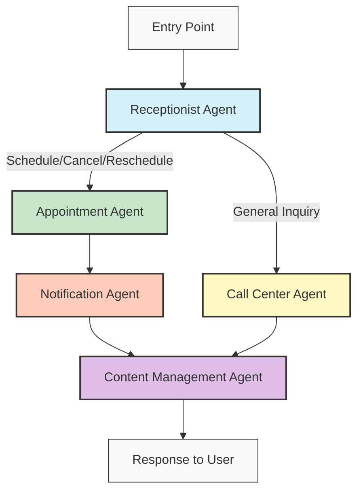

# MedAgent: LangGraph & LangFuse Implementation

## Overview

MedAgent uses two key technologies to power its AI-driven healthcare assistance system:

1. **LangGraph**: Orchestrates the multi-agent workflow, managing state and routing between specialized AI agents
2. **LangFuse**: Provides comprehensive telemetry and observability for AI interactions

## LangGraph Implementation

LangGraph is used to create a structured workflow between different specialized agents, allowing them to collaborate while maintaining conversation state.

### Workflow Architecture



### State Definition and Graph Creation

The workflow begins with defining a typed state schema and creating the StateGraph:

```python
# Define a TypedDict for our state schema
class WorkflowState(TypedDict):
    transcript: str
    intent: str
    patient_id: str
    response: str
    appointment_details: Dict[str, Any]
    conversation_in_progress: bool
    original_intent: str
    appointment_context: Dict[str, Any]

# Create the state graph
workflow_builder = StateGraph(state_schema=WorkflowState)
```

### Adding Nodes and Defining Connections

Each specialized agent is added as a node in the graph:

```python
# Add nodes for each agent
workflow_builder.add_node("receptionist", receptionist_agent_wrapper)
workflow_builder.add_node("appointment", appointment_agent)
workflow_builder.add_node("call_center", call_center_agent)
workflow_builder.add_node("content_management", content_management_agent)
workflow_builder.add_node("notification", notification_agent)
```

### Conditional Routing

Routing between agents is handled through conditional edges based on the detected intent:

```python
# Define the routing function
def route_by_intent(state):
    intent = state.get("intent", "")

    if intent in ["schedule_appointment", "book_appointment",
                 "cancel_appointment", "reschedule_appointment"]:
        return "appointment"
    elif intent == "general_inquiry":
        return "call_center"
    else:
        # Default to call center for unknown intents
        return "call_center"

# Set up the routing from receptionist
workflow_builder.add_conditional_edges(
    "receptionist",
    route_by_intent,
    {
        "appointment": "appointment",
        "call_center": "call_center",
    }
)
```

### Sequential and Parallel Processing

The workflow implements sequential processing for certain paths:

```python
# Direct connections
workflow_builder.add_edge("appointment", "notification")
workflow_builder.add_edge("call_center", "content_management")

# Conditional edge from notification to content_management
workflow_builder.add_conditional_edges(
    "notification",
    after_notification,
    {
        "content_management": "content_management",
    }
)
```

### State Preservation for Multi-Turn Conversations

The system preserves conversation state across turns:

```python
# Check if we're in an ongoing appointment conversation
if state.get("conversation_in_progress") and state.get("original_intent"):
    # If we're in a conversation, preserve the original intent
    updated_state = receptionist_agent(state)

    # Then override the intent with the original intent
    if updated_state.get("intent") not in ["cancel_appointment", "reschedule_appointment"]:
        updated_state["intent"] = state.get("original_intent")
```

### Integration in Flask Application

The LangGraph workflow is integrated into the Flask application:

```python
@app.route('/api/transcribe/<conversation_id>', methods=['POST'])
def handle_transcription(conversation_id):
    # ...processing code...

    # Initialize state with transcript and conversation ID
    initial_state = {
        "transcript": transcript,
        "patient_id": "demo_patient",
        "conversation_id": conversation_id
    }

    # Add conversation state if conversation is in progress
    if conversation_in_progress:
        initial_state["conversation_in_progress"] = True
        initial_state["original_intent"] = original_intent

    # Run the workflow with our wrapper function
    final_state = process_workflow(initial_state)

    # Update conversation store with the results
    CONVERSATION_STORE[conversation_id]["conversation_in_progress"] = final_state.get("conversation_in_progress", False)
    CONVERSATION_STORE[conversation_id]["original_intent"] = final_state.get("original_intent", "")
```

## LangFuse Implementation

LangFuse provides comprehensive observability into AI interactions, helping track performance, errors, and behavior.

### Initialization

LangFuse is initialized in each agent file:

```python
from langfuse.client import Langfuse

# Initialize Langfuse for logging
langfuse = Langfuse(
    public_key=os.getenv("LANGFUSE_PUBLIC_KEY"),
    secret_key=os.getenv("LANGFUSE_SECRET_KEY"),
    host=os.getenv("LANGFUSE_HOST", "https://cloud.langfuse.com")
)
```

### Trace Creation

Each agent creates a trace to track its execution:

```python
# Create a trace in Langfuse
trace = langfuse.trace(
    name="call_center_agent",
    metadata={
        "transcript": state.get("transcript", ""),
        "intent": "general_inquiry"
    }
)
```

### Span Tracking

Spans are used to measure specific operations within an agent:

```python
# Create a span for content correction without context manager
span = trace.span(name="gpt4_content_correction")

# Use GPT-4o to fix the response
correction_response = client.chat.completions.create(
    model="gpt-4o",
    messages=[
        {"role": "system", "content": system_prompt},
        {"role": "user", "content": response}
    ],
    temperature=0.3
)

# Create a comparison span
trace.span(
    name="response_comparison",
    metadata={
        "original_response": response,
        "modified_response": state["response"]
    }
)

# End the original span
span.end()
```

### Error Handling and Status Tracking

Each trace includes error handling and status updates:

```python
try:
    # Agent logic here
    trace.update(status="success")
except Exception as e:
    trace.update(status="error", error={"message": str(e)})
    print(f"Error in content management agent: {e}")
```

## Benefits of This Approach

1. **Modularity**: Each agent handles a specific domain of healthcare interactions
2. **Maintainability**: Separation of concerns makes the system easier to update
3. **Observability**: LangFuse provides detailed insights into each agent's performance
4. **Stateful Conversations**: LangGraph maintains conversation context across interactions
5. **Scalability**: New agents can be added to the workflow without major restructuring

This implementation allows MedAgent to provide a seamless, intelligent healthcare conversation experience while maintaining robust monitoring and state management capabilities.
